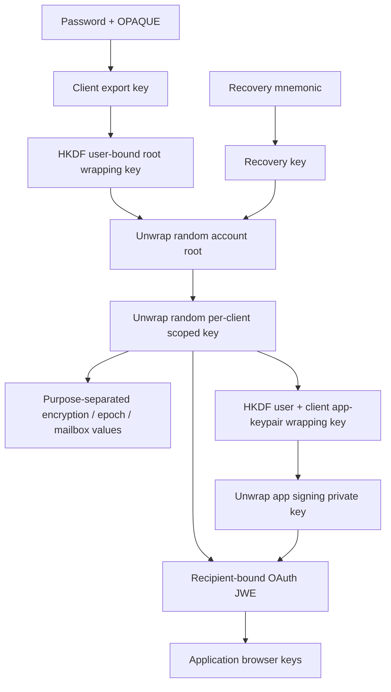

# Review: accounts, identity and key lifecycle

- Reviewer: identity/key review agent; analysis only, no product fixes.
- Date: 2026-09-20.
- Accounts revision: `b7cda8872ee09cfad44f4186ff40096ee3c95483`.
- SDK revision: `e3a9ad167d8d3cf0d8310304716e5c4e75861a47`.
- Component working trees: clean when inspected.
- Status: **analyzed; remediation and regression verification outstanding**.
- Invariants: INV-04, INV-05, INV-07, INV-08.
- Evidence: [targeted checks and limits](../evidence/identity-targeted-checks.md).

The most serious findings are identity-binding failures in registration and recovery and an unsigned-parameter mismatch in OAuth consent. These do not require breaking OPAQUE, AES, ECDH, or JWT signatures. Several ordinary interruption/concurrency paths can also invalidate the only usable key path. A green primitive test suite does not establish correct composition of these operations.

## Scope and boundaries

Reviewed all accounts route groups and their authorization/storage handoffs: verification, registration/login, password change, recovery, root/grant wrappers, OAuth authorize/consent/token/userinfo, key lookup/mailbox, per-service keys, discovery and embedded web serving. Read migration constraints, relevant SQL implementations, JWT/OPAQUE construction, CAP behavior and bootstrap key loading. Reviewed browser signup/login/consent/password/recovery state, SDK OAuth callback, AuthSession, KeyStore, and selected Rust/Web Crypto AES-GCM, AES-KW, HKDF, P-256, PKCE, JWE and key extraction paths.

This is a source review with two focused executable reproductions, not an independent mathematical review of dependencies or an exhaustive fuzzing campaign. UCAN/edit-chain authorization, shared-space protocol and ciphertext replay handling are owned by the sync review. SQLite/local persistence is owned by the data review. Deployment CSP/TLS, backups and resource-service JWT validation require the coordinator's cross-component assessment. No live exploit was performed.

## Key hierarchy and intended state transitions

The accounts server stores the OPAQUE record and encrypted root/scoped/private-key wrappers. The accounts browser can access the root and all grants; it is a trusted cryptographic endpoint. The application browser receives its scoped key and signing key. The accounts server controls public-key discovery and delivered browser code, so protection against a fully malicious accounts origin is outside this architecture. Sync-server ciphertext confidentiality is a separate promise.

Password changes should replace the OPAQUE record and root wrapper together while retaining the same root. Recovery should rewrap that same root, preserving grant access. Root rotation must update every dependent wrapper against a consistent generation. Consent should identify one validated client, scope and recipient from end to end. Session persistence should bind tokens, keys and database identity to the same account/client/generation.

Positive controls observed: token-type discriminators for internal JWTs; explicit ES256/HS256 selection; exact registered redirect matching; S256-only authorization; cryptographic randomness for authorization codes; atomic consume of login/registration/code records; constant-time PKCE comparisons; root/password pair updated in one SQL statement; root/grant rotation uses a SQL transaction; public P-256 points validated before storage; AEAD authentication and purpose-specific derivation; symmetric browser keys are imported as non-extractable CryptoKeys. These controls do not eliminate the composition defects below.

## Findings

### A-01 — Recovery verification is not bound to the account being recovered

**Critical; confirmed source defect; INV-04/05.**

`recover/init` validates a signed recovery token and its purpose, consumes its JTI, then obtains the target account from an independently supplied email. There is no equality check between the verified email and that target. Relevant locations: [recovery.rs:103](../../betterbase-accounts/crates/api/src/handlers/recovery.rs#L103), [purpose check:115](../../betterbase-accounts/crates/api/src/handlers/recovery.rs#L115), [target lookup:132](../../betterbase-accounts/crates/api/src/handlers/recovery.rs#L132). Verification-token issuance accepts a recovery request for the requester's email ([verification.rs:77](../../betterbase-accounts/crates/api/src/handlers/verification.rs#L77), [confirmation:102](../../betterbase-accounts/crates/api/src/handlers/verification.rs#L102)).

An actor who can receive a recovery verification token for an email they control and knows another account's email can obtain a registration state for the other account. Finalization updates the victim's OPAQUE record, optionally replaces the root wrapper, and issues the victim's auth token ([recovery.rs:201](../../betterbase-accounts/crates/api/src/handlers/recovery.rs#L201), [updates:223](../../betterbase-accounts/crates/api/src/handlers/recovery.rs#L223), [token:249](../../betterbase-accounts/crates/api/src/handlers/recovery.rs#L249)). The endpoint does not require successful recovery-blob decryption or knowledge of the mnemonic. CAP and the per-email request limit bound request volume but do not bind identity.

Impact: account takeover, credential replacement, account deletion and key-wrapper destruction. This source path **does not reveal the previous root or decrypt historical data by itself**. Old app keys are still encrypted under the old root; surviving devices or the original recovery blob may retain a recovery path. Do not equate authentication takeover with proven prior-data plaintext recovery.

Remediation: resolve the account from the verified identity, bind a purpose-specific recovery transaction to that account, and define whether account authentication recovery also requires proof of the recovery secret. Test a token for A against B, including canonicalization, and assert no credential/key mutation. No fix applied.

### A-02 — Refresh-token reuse does not revoke the surviving token family

**High; confirmed source defect plus executed PostgreSQL mechanism; INV-04/05.**

Sequential reuse never reaches the used-token table: the handler looks only in active tokens and returns `invalid_grant` for a deleted token ([oauth.rs:649](../../betterbase-accounts/crates/api/src/handlers/oauth.rs#L649)). An attacker who rotates a copied refresh token first keeps the replacement even when the legitimate client later presents the old token.

For the concurrent case, storage inserts the old hash into `used_refresh_tokens`; a duplicate violation triggers a DELETE inside the same already-aborted transaction ([oauth_refresh.rs:118](../../betterbase-accounts/crates/storage/src/postgres/oauth_refresh.rs#L118), [revoke branch:132](../../betterbase-accounts/crates/storage/src/postgres/oauth_refresh.rs#L132)). No savepoint or rollback separates them. The isolated PostgreSQL check produced `23505`, then `25P02`, and left the synthetic active token intact. This contradicts the handler comment claiming atomic revocation. Successful normal rotation itself is transactional.

Remediation: model refresh families and used-token lookup explicitly; serialize rotation and persist revocation outside failed SQL statements. Define safe behavior for benign parallel tabs and a committed response lost in transit. Test sequential reuse, simultaneous reuse, and server-commit/response-loss. The SDK coalesces refresh only within one AuthSession object, so fixing family revocation without cross-tab coordination can convert benign refresh races into logout storms.

### A-03 — Consent can deliver a different application's keys than the signed OAuth client

**Critical; confirmed source composition defect; INV-04.**

The authorize endpoint signs client ID, redirect, scope and recipient key into OAuth state, then duplicates selected fields in the consent URL. The SPA treats the URL fields as authoritative ([consent.tsx:75](../../betterbase-accounts/web/src/pages/consent.tsx#L75)). It looks up the grant for the unsigned `client_id`, unwraps that scoped key and private signing key, and encrypts them to the unsigned `keys_jwk` ([grant read:183](../../betterbase-accounts/web/src/pages/consent.tsx#L183), [payload:223](../../betterbase-accounts/web/src/pages/consent.tsx#L223)).

The backend instead obtains its client from the signed OAuth state ([oauth.rs:279](../../betterbase-accounts/crates/api/src/handlers/oauth.rs#L279)), accepts the supplied opaque JWE/thumbprint ([oauth.rs:407](../../betterbase-accounts/crates/api/src/handlers/oauth.rs#L407)), and returns that JWE after code exchange ([oauth.rs:624](../../betterbase-accounts/crates/api/src/handlers/oauth.rs#L624)). It cannot see the payload's client identity. The authenticated grant lookup intentionally permits the account browser to read any of its grants ([oauth.rs:872](../../betterbase-accounts/crates/api/src/handlers/oauth.rs#L872)).

Source counterexample: a registered malicious client with an attacker-controlled redirect initiates its own valid authorization/PKCE recipient, but directs the user to consent with the visible `client_id` changed to an existing target application. The user must approve while their root is available (or reauthenticate). The browser encrypts the target app's existing scoped/signing keys to the malicious client's original recipient. Signed-state verification and extended PKCE both still pass because their attacker-chosen fields remain internally consistent. The displayed client name/scope are also unsigned. The SDK's symmetric extractor accepts the first octet key without enforcing the configured client ID ([key_extraction.rs:22](../../betterbase/crates/betterbase-auth/src/key_extraction.rs#L22)), though an attacker does not need to use the SDK.

Impact: disclosure of target-app scoped encryption and private signing keys. Actual access to historical ciphertext still depends on obtaining the relevant ciphertext/resource authorization; do not claim a malicious client's OAuth token automatically has the target client's privileges. Precondition: a registered attacker-controlled client/redirect, a victim with a target grant, and user consent to the crafted request. This is not demonstrated as an arbitrary unauthenticated read.

Remediation: the UI must obtain a single server-validated authorization context; client identity, displayed scopes and recipient used for wrapping must come from it. Bind JWE payload identity to issuer/account/client/transaction and validate it at the SDK boundary. Add a browser test that changes each duplicate URL parameter independently and rejects mismatches before reading keys. No live exploitation performed.

### A-04 — Registration can overwrite an existing username's credentials

**Critical; confirmed source defect; INV-04/05.**

Registration correctly binds a verification token to the submitted email ([auth.rs:49](../../betterbase-accounts/crates/api/src/handlers/auth.rs#L49)). It then calls `get_or_create_account` with a separately submitted username ([auth.rs:75](../../betterbase-accounts/crates/api/src/handlers/auth.rs#L75)). The SQL resolves a conflict on `(issuer, username)` by returning the existing row without comparing its email or registration status ([accounts.rs:37](../../betterbase-accounts/crates/storage/src/postgres/accounts.rs#L37)). Finalization unconditionally replaces that row's OPAQUE record and root wrapper ([accounts.rs:155](../../betterbase-accounts/crates/storage/src/postgres/accounts.rs#L155)) and returns its auth token ([auth.rs:163](../../betterbase-accounts/crates/api/src/handlers/auth.rs#L163)).

An actor with a fresh verified email can submit an existing user's public username. A conflicting username is not rejected, and no old password or existing email verification is required. The email uniqueness constraint does not help when the actor uses a fresh address. The send-verification handler even comments that conflict is caught at finalization, but that guard does not exist.

Impact: independent account-takeover path and replacement of the encrypted root wrapper. As in A-01, previous ciphertext plaintext is not revealed merely by replacing the wrapper. Remediation: separate account reservation from completion, bind both email and username to the reservation, reject registered accounts, and perform compare-and-set completion with a purpose-bound state. Test conflicting username/different email, concurrent initial registration, repeated completion and attempts to reuse recovery/password-change states across routes.

### A-05 — The normal recovery page consumes its one-use token twice

**High; confirmed source defect; INV-05.**

The recovery page fetches the encrypted blob using the verification token ([recover.tsx:110](../../betterbase-accounts/web/src/pages/recover.tsx#L110)), retains that same token ([recover.tsx:127](../../betterbase-accounts/web/src/pages/recover.tsx#L127)), and submits it to recovery init ([recover.tsx:146](../../betterbase-accounts/web/src/pages/recover.tsx#L146)). Blob fetch consumes the JTI ([recovery.rs:74](../../betterbase-accounts/crates/api/src/handlers/recovery.rs#L74)); init consumes it again ([recovery.rs:119](../../betterbase-accounts/crates/api/src/handlers/recovery.rs#L119)). Storage correctly rejects duplicate consumption ([verification.rs:168](../../betterbase-accounts/crates/storage/src/postgres/verification.rs#L168)).

Consequently a legitimate complete UI recovery cannot progress past init even with the correct email, phrase and new password. A wrong phrase also consumes the token before decryption, preventing a second attempt with the same token. This does not block A-01, which does not fetch the blob first.

Remediation: introduce a coherent recovery transaction or a narrowly scoped continuation credential; retain one-use protection at the state-changing boundary. Test the real page sequence, including phrase retry and response loss. No browser reproduction executed.

### A-06 — Transient grant-read failures can silently replace durable key identity

**High; confirmed source defect; INV-05.**

Consent treats every initial grant-read failure as “no existing grant” and generates a new scoped key ([consent.tsx:181](../../betterbase-accounts/web/src/pages/consent.tsx#L181)). Its second lookup treats network/decryption/validation failures as permission to generate a new app keypair ([consent.tsx:33](../../betterbase-accounts/web/src/pages/consent.tsx#L33)). The server preserves a nonempty old scoped wrapper, yet unconditionally overwrites the app public key/private-key blob ([oauth.rs:339](../../betterbase-accounts/crates/api/src/handlers/oauth.rs#L339), [oauth.rs:393](../../betterbase-accounts/crates/api/src/handlers/oauth.rs#L393), [oauth_grants.rs:252](../../betterbase-accounts/crates/storage/src/postgres/oauth_grants.rs#L252)).

If the first read fails once and later requests succeed, a fresh scoped key can be delivered to the app while the server retains the previous scoped wrapper. The new signing blob is wrapped under the fresh key and overwrites the old identity. A later fresh-device login recovers the old scoped key, cannot unwrap the replacement signing blob, and silently generates another identity. Even a failure only in the second read rotates the signing identity. Concurrent first consent has a related read-then-write race: the “first-write-wins” decision is outside the unconditional SQL update.

Impact: loss of recoverability for newly encrypted records, inability to decrypt prior records in the new session, loss of signing identity and shared-space access. Existing device copies may allow recovery; permanent loss depends on which keys survive. Remediation: fail closed on unavailable/corrupt existing key material; distinguish explicit absence from all other failures; atomically install a consistent scoped-key/signing-key bundle with version/CAS protection. Test read timeout, malformed blob, simultaneous first consent and crash between bundle writes.

### A-07 — Root rotation lacks generation/completeness checks against concurrent changes

**High; confirmed source race; INV-05.**

The rotation API validates ownership only for supplied grants, then accepts any list including an incomplete list ([rootkey.rs:140](../../betterbase-accounts/crates/api/src/handlers/rootkey.rs#L140)). Storage overwrites the root and only the listed grants; it neither checks a previous root generation nor locks the grant set ([composite.rs:41](../../betterbase-accounts/crates/storage/src/postgres/composite.rs#L41)). A missing recovery blob leaves the previous blob unchanged ([composite.rs:74](../../betterbase-accounts/crates/storage/src/postgres/composite.rs#L74)). Separate root/grant PUT endpoints can also commit partial transitions.

Concrete legal schedule: device A reads grants to rotate root R0→R1; device B consents to a new grant wrapped under R0; A commits its earlier grant list and root R1. B's grant remains wrapped under R0. Likewise, a password-change operation prepared under the old root can commit its wrapper after root rotation, pairing R0 with grants now wrapped under R1; or rotation prepared under the old export key can overwrite the wrapper after password change. Transactional atomicity of the supplied rows does not establish snapshot completeness.

Remediation: account key generation with expected-version checks, an explicit full dependent-wrapper set, and coordination with consent/password/recovery writes; reject stale snapshots and incomplete rotation. Define recovery-blob replacement/invalidation semantics. Test these interleavings on PostgreSQL. No full race reproduction executed.

### A-08 — An in-flight refresh recreates a logged-out session

**High; reproduced against actual AuthSession control flow; INV-08.**

`destroy()` removes persisted state and marks the object disposed ([session.ts:390](../../betterbase/js/src/auth/session.ts#L390)); a refresh already awaiting the token endpoint then writes new credentials and persists them without checking `disposed` or a session generation ([session.ts:442](../../betterbase/js/src/auth/session.ts#L442)). `scheduleRefresh` checks disposal, but it runs after persistence. The targeted harness observed a successful restore after logout when the pending refresh resolved.

Impact: logout does not reliably terminate local authentication; a late response can also overwrite a new session during account switching. Non-extractable encryption keys cleared by logout may be absent, but access/refresh credentials still reappear. Remediation: cancel/fence asynchronous work by session generation; refuse state writes after disposal; prevent old work from overwriting the replacement account. Add deterministic delayed-response logout/account-switch tests plus browser coverage.

### A-09 — Password recovery/change does not revoke prior authenticated sessions

**High; confirmed implementation limitation; INV-05.**

Auth JWTs last 14 days and validation checks signature/type/time without an account session generation ([jwt.rs:184](../../betterbase-accounts/crates/auth/src/jwt.rs#L184), [auth.rs:365](../../betterbase-accounts/crates/api/src/handlers/auth.rs#L365)). Password completion/recovery updates credentials but neither revokes OAuth refresh tokens nor invalidates existing auth JWTs ([password_change.rs:194](../../betterbase-accounts/crates/api/src/handlers/password_change.rs#L194), [recovery.rs:223](../../betterbase-accounts/crates/api/src/handlers/recovery.rs#L223), [composite.rs:10](../../betterbase-accounts/crates/storage/src/postgres/composite.rs#L10)). Refresh expiry slides with each rotation.

Someone retaining an old auth token can continue root/grant/key/account operations after the legitimate user changes or recovers the password; an old app refresh token can continue obtaining new access tokens. There is no per-account token-generation/revocation check in the reviewed model. This is distinct from the unavoidable inability to erase keys/plaintext already downloaded.

Remediation: define “log out other devices” and recovery revocation semantics, maintain revocable auth sessions or account generations, revoke/fence refresh families transactionally, and define the bounded lifetime of resource-server access tokens. Test old credentials after recovery/change, including a concurrently committing refresh. A product decision to retain sessions must be explicit; it cannot be presented as remediation for stolen sessions.

### A-10 — Browser key/session storage is not identity scoped

**High candidate; source mismatch confirmed, downstream corruption requires integration test; INV-04/08.**

KeyStore uses one fixed IndexedDB database and fixed key IDs ([key-store.ts:22](../../betterbase/js/src/auth/key-store.ts#L22)); AuthSession's configurable localStorage prefix does not namespace the keys ([session.ts:82](../../betterbase/js/src/auth/session.ts#L82), [session.ts:95](../../betterbase/js/src/auth/session.ts#L95)). Two sessions with different prefixes can read whichever encryption key was imported most recently, and destroying either clears all keys. OAuth ephemeral keys likewise use one cross-tab slot while state/verifier live in tab-local sessionStorage ([client.ts:81](../../betterbase/js/src/auth/client.ts#L81)), so parallel login can overwrite the other tab's decryption key.

On a cross-tab account replacement, the storage handler changes tokens and personal-space identity in place ([session.ts:571](../../betterbase/js/src/auth/session.ts#L571)). React's key-loading effect depends only on session-object identity ([auth/react.ts:201](../../betterbase/js/src/auth/react.ts#L201)); no account-change notification is emitted by the non-null storage update. Consumers can therefore retain the old keys/database while `getToken()` reads new account credentials. The exact data loss/disclosure outcome depends on provider lifecycle and is handed to the sync/examples review.

Remediation: key all durable/session state by issuer/account/client and generation, bind snapshots of credentials and keys together, notify consumers on identity replacement, and isolate ephemeral keys by OAuth transaction. Test parallel login, two configured sessions, and account replacement in another tab while unsynced local edits exist. Do not treat separate localStorage prefixes as account isolation today.

### A-11 — Refresh uses the first grant scope instead of the current authorization's scope

**Medium; confirmed source defect; INV-04.**

Both grant UPSERT paths leave `scope` unchanged for an existing account/client grant ([oauth_grants.rs:45](../../betterbase-accounts/crates/storage/src/postgres/oauth_grants.rs#L45), [oauth_grants.rs:73](../../betterbase-accounts/crates/storage/src/postgres/oauth_grants.rs#L73)). Code exchange uses the current code scope, but refresh uses the old grant scope ([oauth.rs:604](../../betterbase-accounts/crates/api/src/handlers/oauth.rs#L604), [oauth.rs:704](../../betterbase-accounts/crates/api/src/handlers/oauth.rs#L704)). Thus a narrow later authorization regains historically broader scopes on refresh, or a legitimate added capability disappears. Refresh records do not carry their own authorized scope; refresh also does not re-check current client allowed scopes.

Remediation: bind scope to the authorization/refresh family, cap it by current permitted policy, and explicitly model changes to persistent consent. Test broad→narrow, narrow→broad and client-policy withdrawal, both immediately and after refresh. Existing historic authorization limits severity; this is not an unrestricted cross-client scope escalation.

### A-12 — Email-code attempts and consumption are not atomic

**Medium; confirmed source race; INV-07.**

Code verification reads the record/attempt count, increments separately, compares the hash, then best-effort deletes ([verification.rs:80](../../betterbase-accounts/crates/api/src/verification.rs#L80)). Storage's increment and delete do not check returned row counts or consume the code conditionally ([storage verification.rs:110](../../betterbase-accounts/crates/storage/src/postgres/verification.rs#L110)). Parallel requests that have already read the record can exceed the declared five-attempt bound; multiple correct requests can each succeed after another deletes the row. Each success issues a fresh random JWT JTI, so later token consumption does not deduplicate those successes.

Remediation: serialize attempts and consume successful verification atomically, with conditional updates/row locking and a single issuance state. Test concurrent wrong attempts and concurrent correct-code confirmations. Proxy limits constrain volume but do not make the per-code bound true. No brute force or live verification requests executed.

### A-13 — Accounts assurance does not cover the critical state machines

**High assurance gap; inventory confirmed.**

There are no accounts storage tests in this snapshot and no Rust route-level registration/recovery/consent tests. Native tests exercise primitives/helpers; browser library tests do not cover the complete consent/recovery pages. The CI comment that database tests skip without `DATABASE_URL` overstates what enabling PostgreSQL achieves. Coordinator ran the native baseline with PostgreSQL configured and reported 26 tests with zero storage tests; see central baseline evidence for the command/results.

Required gates: real PostgreSQL identity-binding and concurrency tests; actual browser signup→consent→refresh→password-change→fresh-device login→recovery using existing encrypted data; negative consent-parameter tests; lost-response and logout races; signing-key continuity tests. Production-like constraints must be in these tests, not just mocked storage methods.

### A-14 — Opening recovery setup replaces the previous recovery secret before confirmation

**High; confirmed source defect; INV-05.**

Recovery setup generates a new mnemonic on mount and immediately stores the corresponding encrypted root ([recovery-setup.tsx:27](../../betterbase-accounts/web/src/pages/recovery-setup.tsx#L27)). This happens before the user confirms saving the phrase. The server replaces the single recovery blob for that account ([recovery.rs:17](../../betterbase-accounts/crates/storage/src/postgres/recovery.rs#L17)). Closing the page, losing the browser, or refreshing after the write can therefore invalidate the user's previously recorded phrase while leaving the new phrase unrecorded. The continue action also does not check `blobStored` ([recovery-setup.tsx:101](../../betterbase-accounts/web/src/pages/recovery-setup.tsx#L101)), so a user can leave before durable setup is confirmed.

The existing password/device may still recover the root; this is loss of the established recovery path, with permanent loss conditional on later losing those alternatives. Remediation: stage the new recovery record, require phrase confirmation and acknowledged storage before activating it, and preserve the previous recovery path until that transition commits. Test closing/reloading during replacement and delayed/failed writes. No live recovery data was changed.

## Architecture observations and follow-up limits

- **Registration state has no operation discriminator.** Signup, recovery and password change share the same registration-state table and JWT type, while finalizers have different checks. This magnifies A-04 and makes route substitution difficult to reason about. Use purpose-bound states and transactional completion; test all cross-finalizer combinations.
- **Successful cryptography is not authenticated workflow context.** JWE proves ciphertext integrity for a recipient, not that the intended client/account consented to that payload. A-03 is the principal example. Root wrapping similarly needs generation/state binding in addition to AES-KW integrity.
- **Key atomicity spans browser and server stores.** Symmetric key imports, signing-key import and localStorage credentials are separate commits. A crash or storage failure mid-callback can leave new keys with old tokens. Scope this into the A-10 remediation and test hard failures at each commit.
- **Signing private keys are extractable JWKs.** `importAppPrivateKey` stores the JWK directly ([key-store.ts:363](../../betterbase/js/src/auth/key-store.ts#L363)). The non-extractability claim applies to symmetric and ephemeral ECDH keys, not all keys. Non-extractability also does not protect plaintext or crypto operations from arbitrary code already executing in the app origin.
- **Root recovery limits forward-secrecy claims.** Personal epoch keys derive forward from a recoverable scoped root ([epoch.rs:41](../../betterbase/crates/betterbase-crypto/src/epoch.rs#L41)). Recovery of that root recovers prior epoch keys; a retained epoch key derives later keys. Shared-member revocation therefore requires fresh undisclosed entropy and is separately assessed by sync review. Treat “forward secrecy” comments as a claim requiring a defined adversary, erasure policy and retained-root exclusions.
- **Signing-key rotation is not a verified operational workflow.** The process caches signing material/public validation keys at startup while JWKS reads storage on request. Bootstrap `INSERT ... WHERE NOT EXISTS` lacks a uniqueness guard against concurrent first starts. Multi-instance bootstrap/rotation/restart behavior needs isolated tests; not promoted to an additional high-confidence exploit finding here.
- **OPAQUE dependency configuration and interoperability:** the server uses an Identity KSF type; the browser delegates to the installed Serenity library. No password-hardening conclusion is drawn merely from the server type, because client KSF configuration governs that part of OPAQUE. Native/browser interoperability, KSF parameters and compromised-server password-guessing cost need dedicated evidence; they are not established by this review.
- **No finding from JWT algorithm confusion or basic AEAD checks.** Reviewed implementations explicitly choose algorithms, check internal token types and authenticate ciphertext. This limited negative observation is not a proof of all possible parser/interoperability behavior. Rust JWE's supported optional-header surface differs from the Web Crypto path; expand independent vectors rather than treating round trips as interoperability proof.

## Completion and remediation handoff

Analysis of this assigned scope is complete at the level stated above. A-01 through A-09, A-11/A-12 and A-14 have direct source arguments; A-02/A-08 additionally have targeted executable evidence. A-10's storage/lifecycle mismatch is established, with actual application data consequences pending cross-component reproduction. A-13 records missing assurance rather than a demonstrated exploit.

No finding is fixed or verified. Remediation should first make identity and consent contexts authoritative (A-01/A-03/A-04), then implement explicit account/grant/session generations and transactional transitions, while adding the negative/chaos tests described above. Retest the full dependency chain afterward; changing refresh revocation alone can expose benign cross-tab races, and changing wrappers without migration/version handling can strand existing test data.
